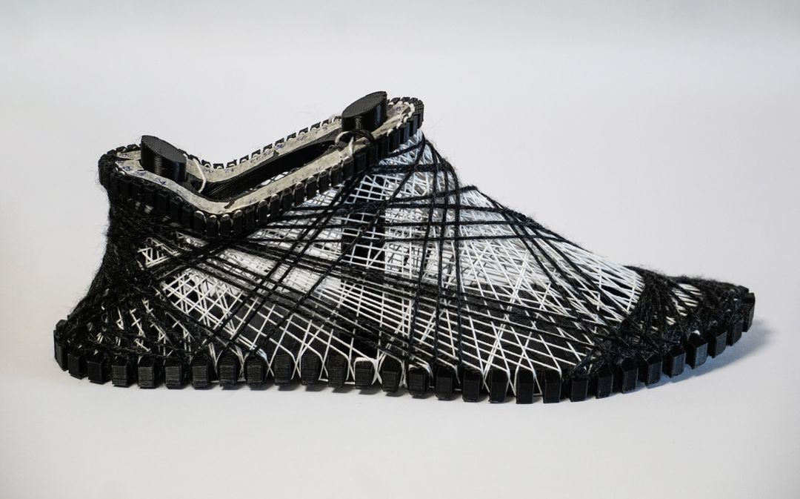

# AdidiTech: Robotic Fiber-Winding Sneaker Design

## 🧵 Overview

AdidTech is a conceptual sneaker design exploring the use of robotic fiber winding techniques to generate lightweight, tailored patterns for everyday footwear with the computational tool and the robotic fabrication. This project reimagines how sneakers might be fabricated in a future where robots and fibers merge to create form.

## 🛠 Tools & Process

The design was developed using:
- **Grasshopper** (Rhino) to generate the 2D and 3D fiber winding paths
- **KUKA|prc** plugin for simulating robotic motion (conceptual phase)
- **Hand-winding prototype** to test physical feasibility

While the robotic execution remains conceptual due to lab limitations, the winding patterns were designed with robotic fabrication in mind.

## 👩‍🎨 Credits

The Project was developed as a team effort with Max and Bill
